# RedEye açılış sayfası ve erişim sağlanması
 - Tarayıcıya, https://redeye.vodafone.com.tr/web/anomalydashboard/ url girilerek, açılan sayfada ilgili kullanıcı bilgileri sağlanır. Ardından Etki Alan Adı seçildikten sonra, açılan SMS/E-Posta doğrulama sayfasından uygulamaya erişim sağlanır.
 - Belirlenen süre içerisinde, doğrulama kodu giriş yapılmazsa süre doldu ibaresi yer alır.
 - Herhangi bir problem yaşanırsa Hata Bildirimi butonu içerisinde yer alan ve sol altta çıkan mail adresine mail atılabilir. 

  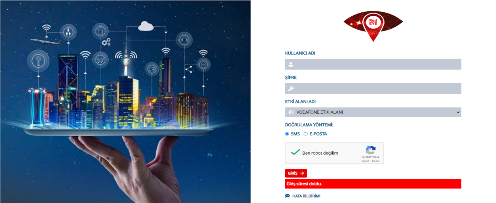

  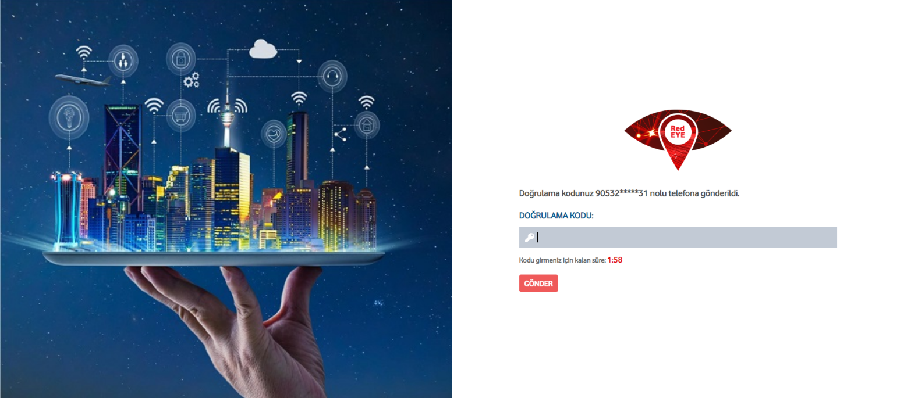
  ##### Görsel 1: Redeye açılış sayfası ve uygulamaya erişimin sağlanması
 # 2- Arayüz Yerleşimi
* Arayüz aşağıdaki 6 ana kısımdan oluşur:

1.Konfigürasyon Seçimi

2.Harita 

3.Interval Veri Tablosu

4.Trend Grafiği

5.Özet Bilgiler

6.Son Yenileme Zamanı

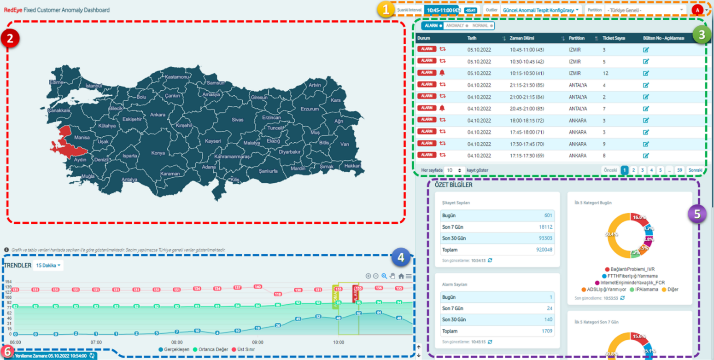
##### Görsel 2: Arayüz kısımları

# Konfigürasyon Seçimi:
## 2.1 Outlier Seçici
 - Outlier kısmından arayüzde gösterilecek olan tanımlı outlier listesinden seçim yapılır.
 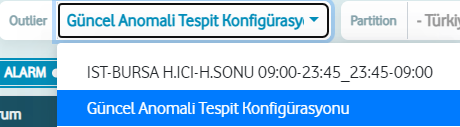
##### Görsel 3: Outlier Seçici

 ## 2.2 Partial Seçici
 -  Herhangi bir partition seçimi yapılmazsa, ekranda tüm partition verilerinin toplamı gösterilir. Partition seçimi yapılarak trend grafiği, interval veri tablosu ve özet bilgiler alanlarında seçilen  partition özelinde hesaplanmış veriler gösterilir. Ekranda gösterilen tüm bilgiler, bu seçime bağlı olarak gösterilmektedir.

 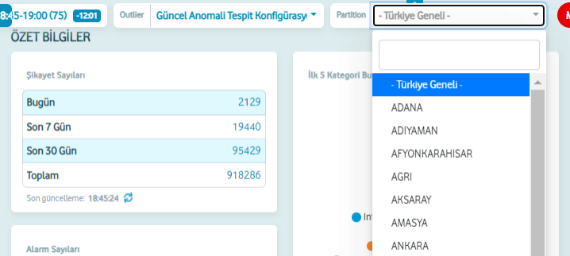
 ##### Görsel 4: Paritition Seçici
## 2.3 İnterval Seçici
 -  Mevcut interval içerisinde bulunulan son zaman dilimini, kalan süreyi ve intervalin sıra numarasını ifade eder.
 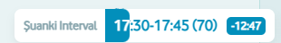
 ##### Görsel 5: Interval Göstergesi

 # 3-Harita:
 - Tüm illerin mevcut zaman aralığındaki durumunu göstermektedir. İl üzerine tıklandığı zaman gelen ekran şöyledir
 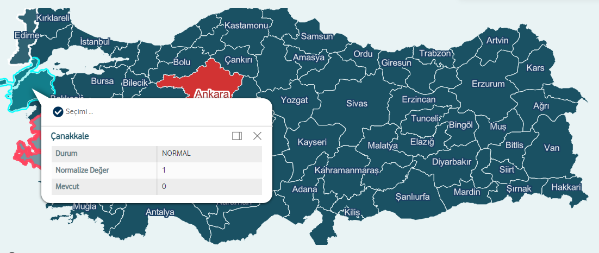
 ##### Görsel 6: Harita
 

 -  Bu ekranda seçilen şehrin mevcut ve normalize ticket değerini gösterir, bunlara göre de durum bilgisi yer almaktadır.
 - Seçimi Uygulaya basıldığında tüm ekran için partition seçimi mevcut il olacak şekilde güncellenir.
 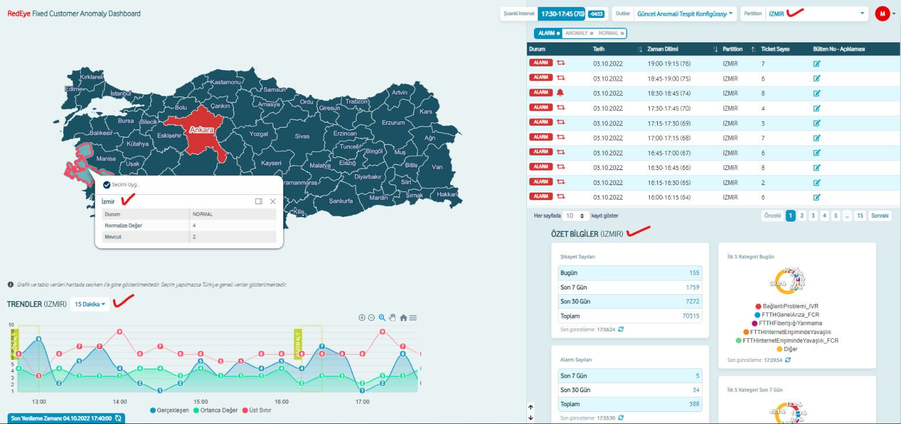
 ##### Görsel 7: Seçilen “IZMIR” Partition değerinin arayüzde uygulanması

 # 4- Interval Veri Tablosu:
* Zaman aralıklarında seçilen Partition’a ait Ticket sayıları ve zaman aralığının durumu gösterilir.
## 4.1- Durum Filtresi:
* Tabloda gösterilecek durum tipleri filtrenebilir. Varsayılan olarak sadece alarm gösterilir.

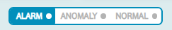
##### Görsel 8: Tablo Durum Filtresi
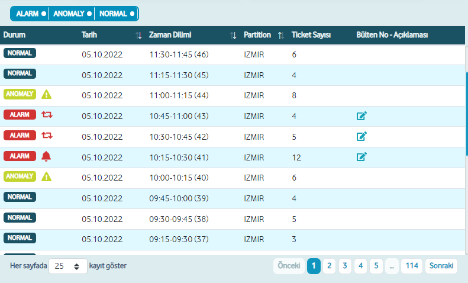
##### Görsel 9: Tüm Durumlar aktif iken Interval Veri Tablosu görünümü
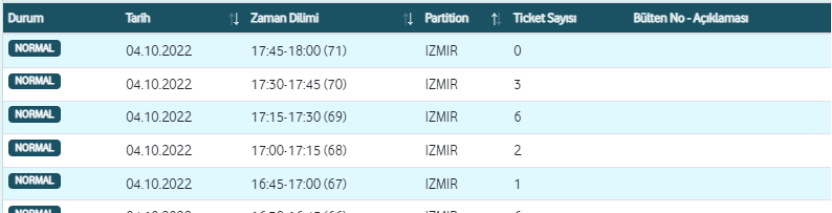
##### Görsel 10: Sadece Normal durumu aktif iken Interval Veri Tablosu içeriği
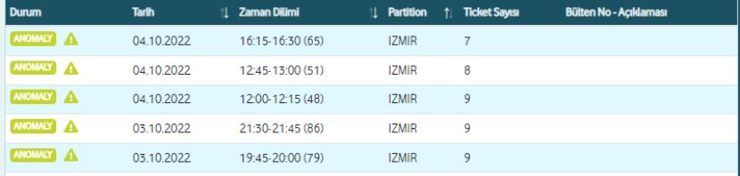
##### Görsel 11: Sadece Anomaly durumu aktif iken Interval Veri Tablosu içeriği
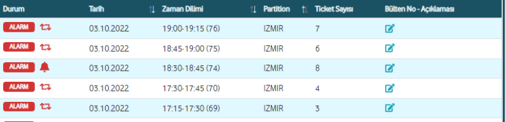
##### Görsel 12: Sadece Alarm durumu aktif iken Interval Veri Tablosu içeriği

#### 4.2- Durum gösterimleri:
* Durum kolonunda, Interval veri satırındaki Partition değerinin ilgili zaman aralığındaki gerçekleşen durumu gösterilir. Durum gösterimleri ve anlamları aşağıdaki gibidir:

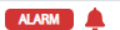

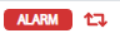

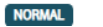

## 4.3- Bülten Bilgileri:
* Sadece Alarm durumunda olan zaman aralıkları için Bülten bilgileri girilebilir. 
* Bülten Bilgileri “Bülten No-Açıklama” kolonunda gösterilir. ikonuna tıklanarak Bülten Bilgileri güncellenebilir.

## 4.4- Sayfalama Seçenekleri:
* Tabloda gezinmek için kullanılır.
* Sol taraftaki seçenek kutusundan her sayfada kaç kayıt listeleneceği seçilebilir.
* Sağ tarafta tablodaki tüm sayfalar gösterilir. Mevcut sayfa mavi renk ile belirtilir. Önceki ve Sonraki butonları ile bir önceki ve bir sonraki sayfaya geçiş yapılabilir. Sayfa numaralarına tıklayarak istenilen sayfaya geçiş yapılabilir.
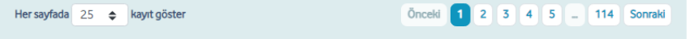
##### Görsel 13: Sayfalama Seçenekleri

 # 5- Trend Grafikleri
* Trend Grafiğinde; seçilen Partition değerine ait Ticket sayılarının, yapılan Trend seçimine göre bulunduğu Trend aralığındaki değerleri gösterilir. 
* Anomaly ve Alarm durumları, başlangıç ve bitiş zaman aralığı grafik üzerinde işaretlenerek gösterilir.

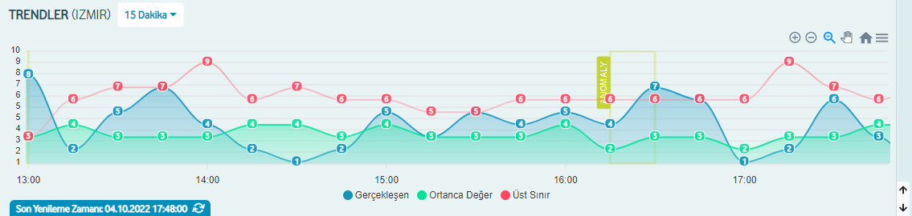
##### Görsel 14: “IZMIR” partition değerine “15 Dakika” Trend aralıklarındaki Ticket sayılarının gösterimi

* Trend grafiğinde “Gerçekleşen”, “Ortanca Değer” ve “Üst Sınır” değerleri gösterilir.
* Grafik lejantı grafiğin altında gösterilmektedir. Lejant üzerinde istenen veri tipine tıklanarak, veri tipi grafik üzerinde gizlenebilir veya gösterilebilir.

##### Görsel 15: “IZMIR” partition değerine “1 Ay” Trend aralıklarındaki Ticket sayılarının gösterimi

* Sağ üstte grafik üzerinde gezinme seçenekleri bulunmaktadır. Bu özellik ile grafikte yakınlaştırma/uzaklaştırma, sola ve sağa kaydırma haraketleri yapılabilir.

##### Görsel 16: Gezinme Seçenekleri

# 6- Özet bilgiler

*  Kullanıcıların ihtiyacı olan genel istatistiki veya özetlenebilir veriler dinamik olarak tablosal ve grafik olarak gösterilir. Örneğin; “En Çok Alarm Oluşturan İller (Türkiye Genelinde Son 30 Gün)” özet bilgileri tablosal olarak gösterilmektedir.
* Seçilen Partition değerine göre özet veriler gösterilir. 
* Her bir Özet Bilgiler Bölümü’nün kendisine ait bir yenileme zamanı tanımlanmıştır. Veriler bu tanımda belirtilen aralıklarda yenilenir. Bu yenileme zamanlaması, Sayfanın Yenileme Zamanı’ndan bağımsız çalışmaktadır.

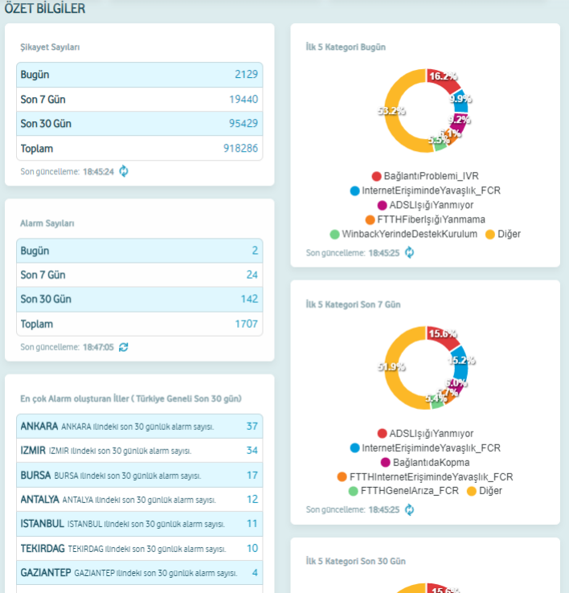
##### Görsel 17: Özet Bilgiler

# 7- Son Yenileme Zamanı Göstergesi:
* Harita, Interval Veri Tablosu ve Trend Grafiği üzerinde gösterilen veriler, belirli aralıklarla yenilenir. Son yenileme zamanı burada gösterilmektedir. Sağ tarafta bulunan Yenile ikonuna tıklanarak, manuel olarak yenileme yapılabilir.

 ##### Görsel 18: Son Yenileme Zamanı Göstergesi